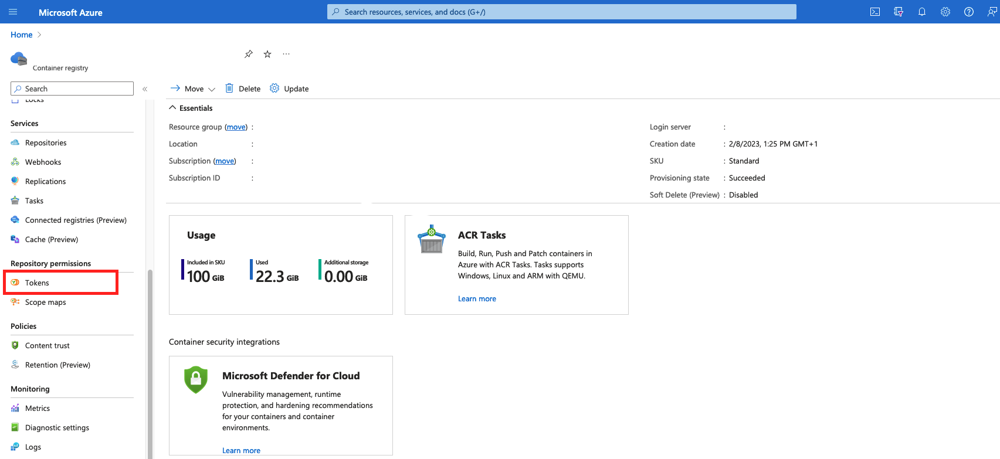
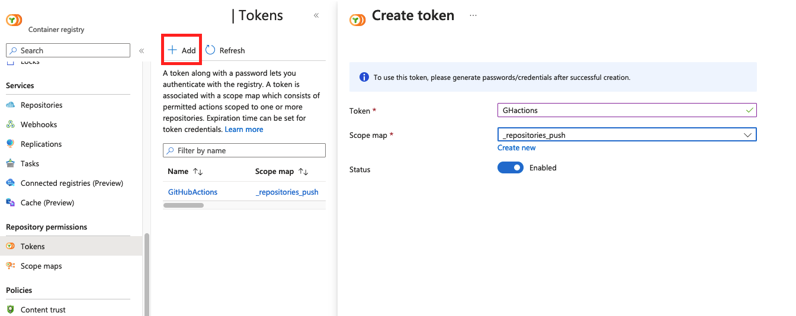

# Building and pushing docker containers

This template makes uses of [invoke](https://www.pyinvoke.org/) to standardize common commands.

In the `tasks.py` file, you will find three commands (`build_image`, `push_image`, and `build_and_push_image`) that you can use to build and push docker images to a remote repository. By default, the template will create three tags when the ENV variable is set to 'stg' or 'prod': (1) latest, (2) git SHA, and (3) package version. When ENV=dev, it only creates the 'latest' tag.

## Authenticating with private docker registries

### On GCP

On GCP, see [this guide](https://cloud.google.com/artifact-registry/docs/docker/authentication). Below you will find an example of a service-account based access token.

Create a service account:

```shell
gcloud iam service-accounts create artifact-writer \
    --description="Read from and write to docker artifact registry" \
    --display-name="Artifact writer"
```

Then, add the following roles:

```shell
export GCP_PROJECT_ID=jasper-ginn-sndbx-v
export GCP_SA_NAME=artifact-writer

gcloud projects add-iam-policy-binding $GCP_PROJECT_ID \
    --member="serviceAccount:artifact-writer@${GCP_PROJECT_ID}.iam.gserviceaccount.com" \
    --role="roles/artifactregistry.reader"

gcloud projects add-iam-policy-binding $GCP_PROJECT_ID \
    --member="serviceAccount:artifact-writer@${GCP_PROJECT_ID}.iam.gserviceaccount.com" \
    --role="roles/artifactregistry.writer"
```

Export a service account key and save it to the .secrets folder in the template:

```shell
export GCP_PROJECT_ID=jasper-ginn-sndbx-v
export GCP_SA_NAME=artifact-writer

gcloud iam service-accounts keys create .secrets/artifact-writer-sa-key.json \
    --iam-account=$GCP_SA_NAME@$GCP_PROJECT_ID.iam.gserviceaccount.com
```

Base64-encode the service account key:

```shell
base64 .secrets/artifact-writer-sa-key.json > .secrets/artifact-writer-b64
```

Log into the registry using docker:

```shell
pwd=$(cat .secrets/artifact-writer-b64)
docker login -u _json_key_base64 -p $pwd https://europe-west4-docker.pkg.dev
```

Update the `DOCKER_REGISTRY_URL` environment variable in the .env file. In this case, the registry URL is `europe-west4-python.pkg.dev` (NB: this is region-specific). This registry URL will be used to tag images so that docker knows where they should be pushed to.

## Building and pushing docker files

To build and push your dockerfiles, execute:

```shell
poetry run invoke build-and-push-image # --no-push-version
```

### On Azure

On Azure, you can create a container registry with at least a Standard SKU. Then, navigate to 'tokens'



And click 'Add'. Configure a token with '_repositories_push' permissions, and store the credentials somewhere safe. 



Your username is the name of the token ('GHactions' in this case). The password is the token that you generated.

Update the `DOCKER_REGISTRY_URL` environment variable in the .env file. In this case, the registry url is `containerregistryfeatheredfrog.azurecr.io`. This registry URL will be used to tag images so that docker knows where they should be pushed to.

## In GitHub actions

There are a variety of ways to authenticate with private docker registries. The most general is to use a username/password combination. There are downsides to this because it is a long-lived access token. For alternatives to the approach below, you can checkout the google-auth [action](https://github.com/google-github-actions/auth), which uses workload identity federation.

```yaml
- name: Build & push docker import to GCP artifact store
  env:
    DOCKER_REGISTRY_USERNAME: ${{ secrets.DOCKER_REGISTRY_USERNAME }}
    DOCKER_REGISTRY_PASSWORD: ${{ secrets.DOCKER_REGISTRY_PASSWORD }}
    DOCKER_REGISTRY_URL: ${{ secrets.DOCKER_REGISTRY_URL }}
  run: |
    docker login -u $DOCKER_REGISTRY_USERNAME -p $DOCKER_REGISTRY_PASSWORD $DOCKER_REGISTRY_URL
    poetry run invoke build-and-push-image # --no-push-version
```

